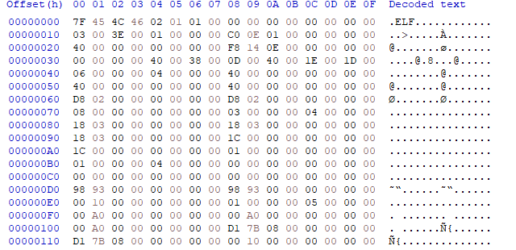
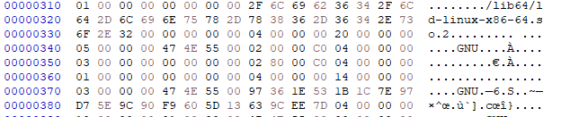
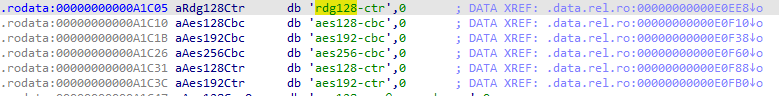
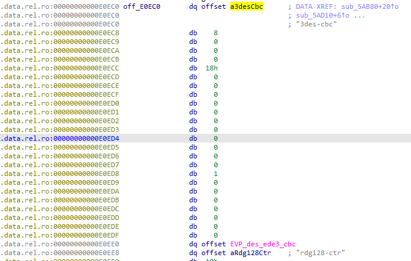
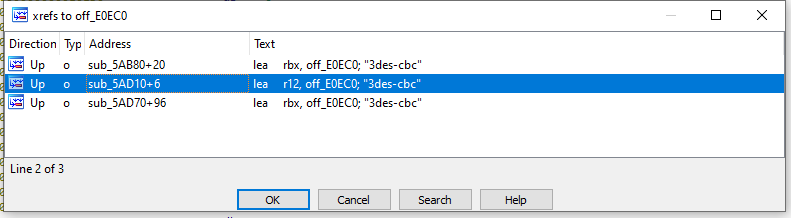

# WriteUp
---
Подсказка начинается в файле **[README.md](ssh-demon\ssh_demon-main\README.md)**. Таск запускается командой **«sudo sshd -p 13569»**. Начнём анализ с файла **sshd**.

Откроем его в хекс редакторе и посмотрим на начало:

Видим, что перед нами файл формата ELF.
Разбирая заголовок файла и строки в нём, можно прийти к выводу, что файл работает в 64-х разрядных системах.

 
Также, анализируя строки файла, можно прийти к выводу, что файл изначально написан на языке С и был собран компилятором GCC.

Также, анализируя строки, можно увидеть, что перед нами часто программного продукта «OpenSSH_8.8». Новость прекрасная, так как этот программный продукт является открытым и его исходные коды доступны в интернете. В связи с этим, можно быстро и легко провести сравнение строк и поискать что-то подозрительное в приложенном файле.

Подозрительным выглядит следующий набор строк с алгоритмами шифрования:

 
В исходном коде есть все эти алгоритмы, за исключением «rgd128-ctr».
Посмотрим, где он вызывается:

 
Приведённая строка вызывается в одном месте и является частью большой структуры.
Посмотрим, где она вызывается:

 
Данная структура вызывается в трёх совершенно разных местах, однако в каждом из них, алгоритмы из неё перебираются итеративно. Сравнивая с исходными кодами, видим, что эта структура вызывается в местах проверки подключения и выборе алгоритма шифрования, при помощи которого передаются учётные данные. Пробуем подключиться, используя этот алгоритм, видим, что попытка проходит успешно.

**Exploit**: `ssh Admin_test_user@127.0.0.1 -p 13569 -c "abs128-ctr,chacha20-poly1305@openssh.com"`
